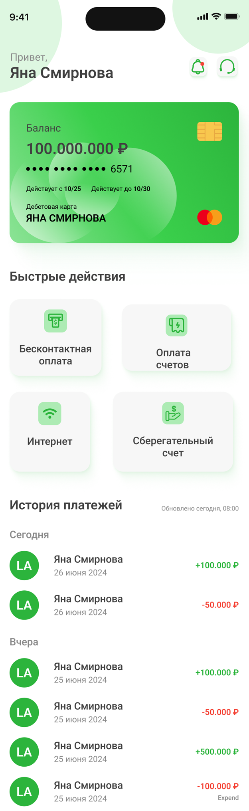

# Руководство пользователя

Добро пожаловать в мобильное приложение NovaBank! В этом руководстве вы найдете инструкции по установке приложения, регистрации, основным функциям и полезные советы.

## Установка приложения

1) Перейдите на официальный сайт NovaBank: https://novabank.com.
2) Скачайте приложение из App Store или Google Play.
3) Установите приложение на ваше устройство.

>[!tip] Совет: Убедитесь, что у вас достаточно свободной памяти на устройстве перед установкой.

## Основные функции приложения

NovaBank — это не просто банк, а ваш финансовый помощник. Вот что вы можете делать:

### Баланс счета

Всегда актуальный остаток, включая начисленные проценты и бонусы.

### Мгновенные переводы

Отправляйте деньги друзьям, родным или бизнесу — даже ночью!

### История операций с фильтрами

Ищете конкретный платёж? Отсортируйте по дате, сумме или категории.

### Безопасные уведомления

Получайте push-сообщения о каждой операции — никаких неожиданностей!

## Таблица функциональности:

| Функция          | Описание                                  |
| ---------------- | ----------------------------------------- |
| Баланс счета     | Показывает текущий остаток на вашем счете |
| Переводы         | Позволяет отправлять деньги               |
| История операций | Показывает все ваши транзакции            |

## Главный экран NovaBank

На главном экране приложения отображается баланс, последние операции и быстрый доступ к переводам.

## Советы для пользователей

### Как настроить профиль:

- Перейдите в раздел "Профиль".
- Нажмите "Редактировать".
- Измените данные (имя, фото, контактную информацию).
- Сохраните изменения.

>[!tip] Совет: Используйте биометрическую аутентификацию для удобного и безопасного входа в приложение.
